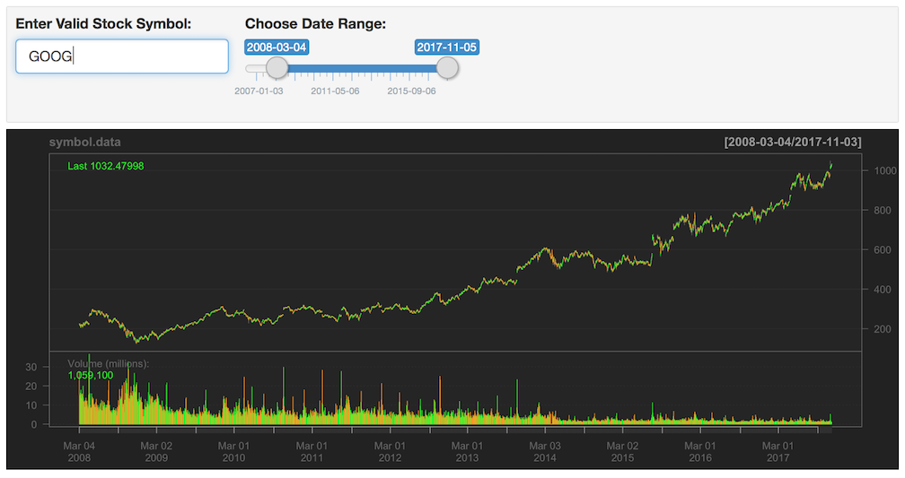

```{r setup, include=FALSE}
knitr::opts_chunk$set(echo = FALSE)
```
## Application Layout (This is a Static Page)

The application provides a simple user interface allowing choice of stock ticker and date range.




## Advantages of the Shiny App

The application loads very quickly without any additional baggage and no ads.

Here is output for Microsoft stock brought live via embedded R code, to demonstrate efficiency.

```  {r custom1, message=F, warnings=F, warning=F }
library(quantmod)

stock.env <- new.env()
getSymbols("MSFT", src="yahoo", env = stock.env, from = as.Date("2007-01-03"),
           to = as.Date("2017-11-03") )
symbol.data <- get("MSFT", envir = stock.env)
chartSeries(symbol.data)
```

The interactive application is available at https://yatinm3.shinyapps.io/ddswk4demo/

## Possible customizations: various charts of pre-selected equities

Typically one is interested in tracking only 20 or 30 equities in their personal investment portfolio:

1. An overlay chart of pre-selected equities can be displayed.

2. The chart of pre-selected equities can be cycled through every 10 seconds.

3. For pre-selected equities, a user can receive emails when price crosses thresholds.

4. Display of moving averages or other custom graph creation

## In Conclusion

- The shiny app platform provides quick, ad-free, stock graphs.

- The graphs can be customized based on business needs.

- The graphs can be customized for every user of the organization.

- We hope you will buy this application


**                             T H A N K      Y O U   **


